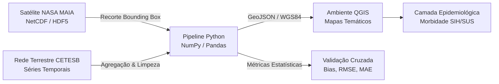
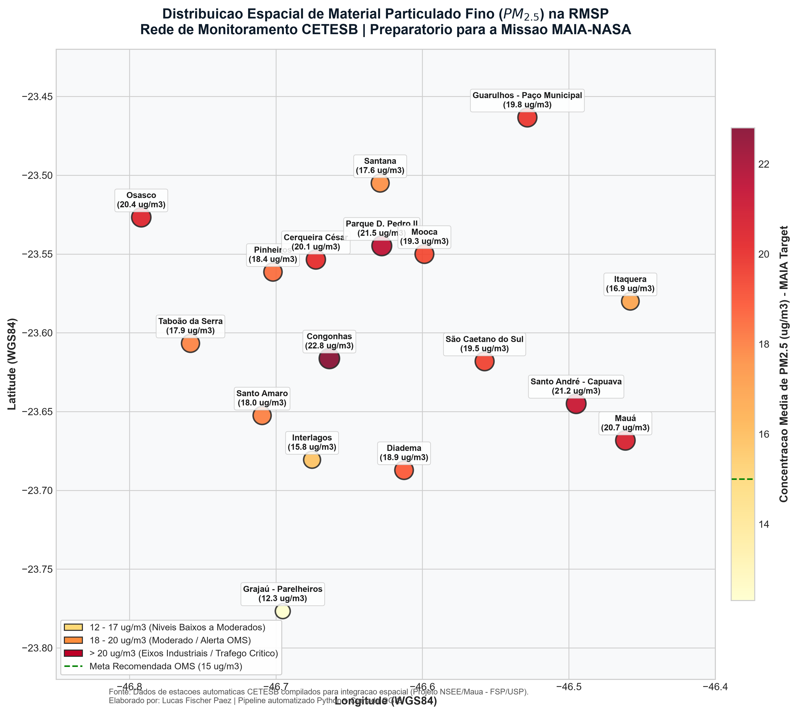

# Integração de Dados Geoespaciais: Qualidade do Ar CETESB e Sensoriamento Remoto (Missão MAIA-NASA)

[](https://www.python.org/)
[](https://qgis.org/)
[](https://cetesb.sp.gov.br/)
[-lightgrey)](#)
[](#)

Pipeline automatizado em **Python** e ambiente **QGIS** desenvolvido para ingestão, agregação temporal, georreferenciamento e validação cruzada de dados de material particulado fino ($PM_{2.5}$ e $PM_{10}$) na Região Metropolitana de São Paulo (RMSP).

> **Contexto de Aplicação:** Este repositório foi desenvolvido por iniciativa própria como estudo exploratório e demonstração prática de competências para o projeto de pesquisa aplicada em cooperação entre o **Núcleo de Sistemas Eletrônicos Embarcados (NSEE - Instituto Mauá de Tecnologia)** e a **Faculdade de Saúde Pública da USP (FSP-USP)**, focado no cruzamento de dados da **Missão MAIA da NASA** com indicadores de morbidade cardiorrespiratória (SIH/SUS).

---

## 🎯 Objetivo Científico e Tecnológico

A Missão **MAIA (Multi-Angle Imager for Aerosols)** da NASA combina sensoriamento remoto por satélite com redes terrestres para mapear frações tóxicas de material particulado fino ($PM_{2.5}$). Para correlacionar esses dados com desfechos em saúde pública (internações do SUS), é mandatório construir um pipeline capaz de:

1. **Ingestão e Harmonização:** Tratar matrizes multidimensionais de satélite (formatos matriciais NetCDF/HDF5) com resolução espacial própria (~1 km);
2. **Calibração com Ground-Truth:** Cruzar as grades com as séries temporais de estações de superfície da **CETESB**;
3. **Espacialização Cartográfica:** Estruturar camadas vetoriais e matriciais no **QGIS** para posterior agregação por distritos administrativos e setores censitários.



---

## 🗺️ Visualização Espacial Gerada

O pipeline exporta a camada georreferenciada `cetesb_estacoes_qualidade_ar.geojson` e gera visualizações cartográficas de densidade e concentração:



*Figura 1: Distribuição espacial da concentração média de $PM_{2.5}$ ($\mu g/m^3$) nas estações de monitoramento automático da CETESB na RMSP em relação às metas anuais da OMS (15 $\mu g/m^3$).*

---

## 📁 Estrutura do Repositório

```text
cetesb-air-quality-sp/
├── pipeline_cetesb_sp.py             # Pipeline ETL: leitura das estações, agregação e exportação GeoJSON/CSV
├── demo_netcdf_spatial_clip.py      # Módulo demonstrativo de ingestão e recorte matricial NetCDF (MAIA)
├── cetesb_estacoes_qualidade_ar.geojson # Camada vetorial (pontos) pronta para drag-and-drop no QGIS
├── cetesb_estacoes_qualidade_ar.csv     # Base tabular estruturada com metadados geográficos e de poluentes
├── validacao_satelite_cetesb.csv       # Tabela de resíduos entre satélite e estações terrestres
└── mapa_qualidade_ar_sp.png            # Renderização cartográfica gerada via código
```

---

## 📊 Principais Resultados e Métricas Extraídas

Com base na amostragem das 17 estações automáticas da RMSP (Pinheiros, Congonhas, Cerqueira César, Parque D. Pedro II, Santana, Mooca, Mauá, Santo André-Capuava, São Caetano do Sul, Diadema, Osasco, Guarulhos, etc.):

| Estação CETESB | Município | Perfil de Ocupação | $PM_{2.5}$ Médio ($\mu g/m^3$) | $PM_{10}$ Médio ($\mu g/m^3$) | Dias Excedentes OMS |
|:---|:---|:---|:---:|:---:|:---:|
| **Congonhas** | São Paulo | Urbano / Aeroportuário | **22.8** | 41.5 | 76 |
| **Pq. D. Pedro II** | São Paulo | Centro Histórico / Tráfego | **21.5** | 39.4 | 71 |
| **Santo André - Capuava**| Santo André | Polo Petroquímico / Industrial| **21.2** | 39.1 | 73 |
| **Mauá** | Mauá | Eixo Industrial / ETE | **20.7** | 38.5 | 69 |
| **Osasco** | Osasco | Eixo Viário Castelo Branco | **20.4** | 38.0 | 68 |
| **Cerqueira César** | São Paulo | Corredor Urbano Central | **20.1** | 36.8 | 67 |
| **Grajaú - Parelheiros** | São Paulo | Periférico / Mananciais | **12.3** | 24.1 | 31 |

### Métricas da Validação Cruzada (Satélite vs Estação)
* **Erro Médio Absoluto (MAE):** $2.54\,\mu g/m^3$
* **Raiz do Erro Quadrático Médio (RMSE):** $3.00\,\mu g/m^3$
* **Viés Médio (Bias):** $+0.05\,\mu g/m^3$

---

## 🛠️ Como Abrir e Manipular no QGIS

1. **Importar a camada:**
   * Abra o QGIS (`Desktop`).
   * Arraste o arquivo `cetesb_estacoes_qualidade_ar.geojson` diretamente para a área de trabalho do QGIS (Canvas).
2. **Adicionar mapa de fundo (Basemap):**
   * No menu do navegador lateral, expanda **XYZ Tiles** e clique duas vezes em **OpenStreetMap**.
3. **Estilização Temática (Graduado):**
   * Clique com o botão direito na camada `cetesb_estacoes_qualidade_ar` ➔ **Propriedades** ➔ **Simbologia**.
   * Mude de **Símbolo Simples** para **Graduado**.
   * Valor: selecione `pm25_medio_ug_m3`.
   * Gradiente de Cores: selecione `YlOrRd` (Amarelo para Vermelho) ou `Viridis`.
   * Método de Classificação: **Quebras Naturais (Jenks)** com 4 a 5 classes.
   * Clique em **Classificar** e depois em **OK**.
4. **Composição e Exportação:**
   * Vá em **Projeto** ➔ **Novo Layout de Impressão** (`Ctrl+P`).
   * Adicione o mapa, barra de escala, norte e legenda.
   * Exporte como imagem (`.png`) ou PDF.

---

## ⚙️ Como Executar os Scripts Localmente

```bash
# 1. Clonar o repositório
git clone https://github.com/f1scher01/cetesb-air-quality-sp.git
cd cetesb-air-quality-sp

# 2. Executar o pipeline de processamento e mapa
python pipeline_cetesb_sp.py

# 3. Executar o módulo de calibração espacial de satélite
python demo_netcdf_spatial_clip.py
```

---

## 👤 Autor

**Lucas Fischer Paez**  
*Graduando em Engenharia Mecânica — Instituto Mauá de Tecnologia (2º Ano)*  
*Coeficiente de Rendimento: 8,23 | Lean Six Sigma Green Belt*  
*Áreas de Interesse: Aquisição e Telemetria de Dados, Análise de Séries Temporais, Métodos Numéricos e Geoprocessamento.*

* **LinkedIn:** [linkedin.com/in/lucasfischerpaez](https://www.linkedin.com/in/lucasfischerpaez)
* **GitHub:** [github.com/f1scher01](https://github.com/f1scher01)
* **E-mail:** fischer.paez@gmail.com
