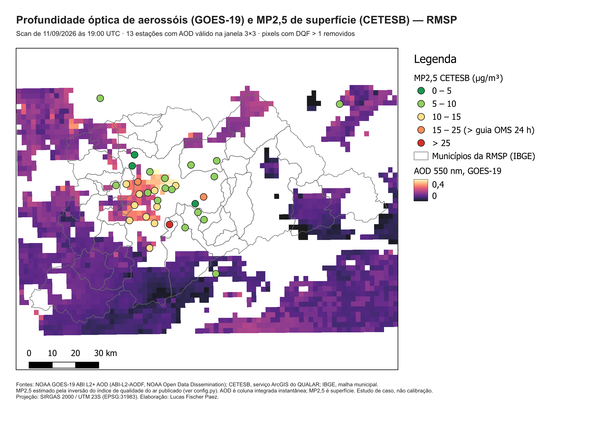
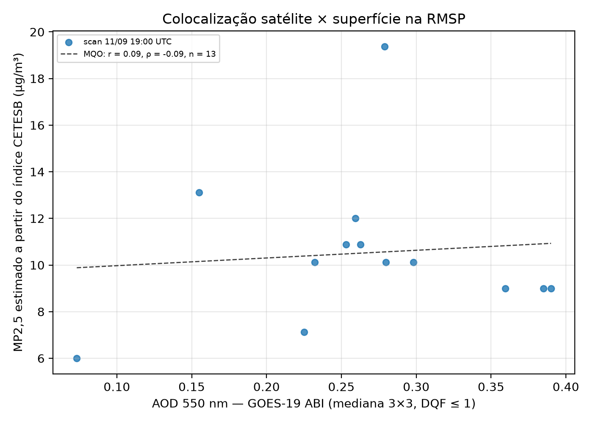

# Aerossóis na RMSP: GOES-19 × CETESB × QGIS

### Pipeline com dados reais de satélite, rede de superfície e limites oficiais

[](#fontes)
[](#decisões-técnicas)
[](#como-executar)
[](#próximos-passos)

Ingestão de **profundidade óptica de aerossóis (AOD 550 nm)** do satélite GOES-19 em NetCDF-4,
reprojeção da grade geoestacionária para a Região Metropolitana de São Paulo, coleta automatizada
da **rede automática da CETESB**, colocalização satélite × estação e montagem do mapa final no
**QGIS por script**, sem abrir a interface.

Tudo roda com o Python que acompanha o QGIS 3.44 LTR. Nenhum `pip install` é necessário.

> **Contexto.** A missão MAIA (NASA/ASI) vai produzir mapas diários de MP2,5 especiado a 1 km,
> com lançamento hoje previsto para 2027–2028. Enquanto não há dado MAIA, este repositório
> monta a cadeia de processamento com os produtos que já existem: mesmo tipo de grandeza (AOD),
> mesmo formato de arquivo (NetCDF/HDF5) e o mesmo problema de fundo, que é ligar coluna
> atmosférica a concentração de superfície.

---

## Resultado



**Figura 1.** AOD do GOES-19 às 19:00 UTC de 11/09/2026 (pixels com DQF > 1 removidos, em branco)
e MP2,5 das estações da CETESB na mesma hora. Layout gerado por `qgis_mapa.py` em SIRGAS 2000 /
UTM 23S.



**Figura 2.** Colocalização das 13 estações que tinham ao menos 3 pixels válidos na janela 3×3.

### O que o estudo de caso mostra

| Grandeza | Valor |
| :--- | :--- |
| Scan | GOES-19 ABI, disco completo, 11/09/2026 19:00 UTC |
| Cobertura válida no domínio (DQF ≤ 1) | 45,1 % dos pixels |
| AOD mediano no domínio | 0,10 (P90 = 0,17) |
| Estações com MP2,5 na hora do scan | 32 |
| Pares válidos (≥ 3 pixels na janela) | 13 |
| Correlação | Pearson r = 0,09 (p = 0,77) · Spearman ρ = −0,09 (p = 0,76) |

**Não há correlação neste scan, e isso é o resultado esperado.** Quatro razões, em ordem de peso:

1. **Grandezas diferentes.** AOD integra a extinção da coluna inteira num instante; MP2,5 é massa
   junto ao solo. A ponte entre as duas passa pela altura da camada limite e pela umidade, que
   este estudo ainda não usa.
2. **Escalas de tempo diferentes.** O índice da CETESB para MP2,5 acompanha média de 24 h; o scan
   dura 10 minutos.
3. **Faixa estreita.** As 13 estações ficaram entre 6 e 19 µg/m³ num dia limpo. Com pouca variância
   em y e n = 13, qualquer correlação real ficaria abaixo do ruído.
4. **Viés de superfície urbana e borda de nuvem.** Os maiores AOD (0,36–0,39) aparecem em Mooca,
   Parque D. Pedro II e Santana, no centro urbano, com 4 a 6 pixels válidos em 9. Superfície urbana
   clara e contaminação por borda de nuvem são fontes conhecidas de superestimativa em algoritmos
   de AOD sobre terra.

Um único scan serve para validar a **cadeia de processamento**, não a relação física. A relação
só pode ser testada com uma série de dias claros, que é o próximo passo.

---

## Pipeline

| Etapa | Script | Fonte | Saída |
| :--- | :--- | :--- | :--- |
| 1. Coleta de superfície | `coleta_cetesb.py` | CETESB, serviço ArcGIS público do QUALAR | série horária acumulada (CSV), estações (GeoJSON) |
| 2. Limites oficiais | `limites_ibge.py` | IBGE, API de malhas e de localidades | 39 municípios da RMSP (GeoJSON) |
| 3. Satélite | `goes_aod.py` | NOAA GOES-19 ABI L2 AOD, bucket público | AOD recortado e filtrado (GeoTIFF) |
| 4. Colocalização | `colocalizacao.py` | saídas 1 e 3 | pares AOD × MP2,5 (CSV), dispersão (PNG) |
| 5. Cartografia | `qgis_mapa.py` | saídas 1 a 4 | layout exportado (PNG) e projeto `.qgz` editável |

Parâmetros e justificativas ficam centralizados em `config.py`.

---

## Decisões técnicas

**Leitura do NetCDF pelo driver do GDAL, não por xarray.** O GDAL embarcado no QGIS lê a
projeção geoestacionária do ABI com o eixo de varredura correto (`+proj=geos +sweep=x +h=35786023`),
aplica `scale_factor` e `add_offset` da própria variável e entrega a matriz já georreferenciada.
Isso mantém o pipeline inteiro dentro de uma instalação padrão do QGIS.

**Vizinho mais próximo na reprojeção.** O `DQF` é categórico: interpolar a flag de qualidade não
tem significado físico. O AOD usa o mesmo método para continuar alinhado pixel a pixel com a sua
flag. A grade de saída tem 0,02° (~2,1 km), próxima da resolução nativa do ABI sobre São Paulo.

**Filtro DQF ≤ 1.** Mantém retrievals de alta e média qualidade, conforme a recomendação da NOAA
para uso quantitativo.

**Janela 3×3 com mínimo de 3 pixels válidos.** Um único pixel é sensível a ruído e à borda de
nuvem; a mediana de uma janela de ~6 km reduz as duas coisas sem apagar o gradiente urbano.

**Projeto em EPSG:31983.** As camadas continuam em coordenadas geográficas, mas o layout usa
SIRGAS 2000 / UTM 23S para que a barra de escala seja métrica.

### O serviço da CETESB publica índice, não concentração

As camadas do mapa do QUALAR trazem o **índice de qualidade do ar** (adimensional). Comparar
índice direto com AOD seria misturar unidades, então `coleta_cetesb.py` inverte a função linear
segmentada do índice para µg/m³.

Os pontos de quebra foram **verificados nos próprios dados**. Na faixa N1, o serviço só publica os
índices {3, 5, 8, 11, 13, 16, 19, 21, 24, 27, 29, 32, 35, 37, 40}. Essa é exatamente a sequência
`round(40·C/15)` para C inteiro de 1 a 15 µg/m³, ou seja, N1 vai até 15 µg/m³, o padrão final da
Resolução CONAMA 506/2024.

Há uma divergência documentada: a Tabela 2.7 do *Relatório de Metodologia para Avaliação da
Qualidade do Ar* (CETESB, 2025) lista N1 até 25 µg/m³. Com esse limite, o serviço publicaria
índices como 2, 6 e 10, que nunca aparecem. O pipeline segue o que os dados mostram e deixa a
hipótese registrada em `config.py` para confirmação contra uma exportação do QUALAR em µg/m³.

A inversão tem incerteza de meio passo de índice: ±0,19 µg/m³ em N1 e ±0,44 µg/m³ em N2.

---

## Como executar

Pré-requisito: **QGIS 3.44 LTR** instalado (OSGeo4W ou instalador MSI). O Python dele já traz
GDAL, NumPy, Pandas, SciPy, Matplotlib e Requests.

```bat
executar_pipeline.bat 2026-09-11T19
```

Ou etapa por etapa, pelo `python-qgis-ltr.bat` da instalação:

```bat
python coleta_cetesb.py              :: últimas 48 h da CETESB, acumulando na série
python limites_ibge.py               :: municípios da RMSP
python goes_aod.py 2026-09-11T19     :: baixa o primeiro scan da hora (UTC) e recorta
python colocalizacao.py              :: pares e estatística
python qgis_mapa.py                  :: layout PNG + projeto .qgz
```

A janela da CETESB é móvel (48 h). Para montar histórico, agende `coleta_cetesb.py` uma vez por dia
no Agendador de Tarefas do Windows. Horas já coletadas não são duplicadas.

O projeto `qgis/rmsp_aod_mp25.qgz` abre no QGIS com as três camadas e o layout prontos para ajuste manual.

---

## Fontes

- **NOAA GOES-19 ABI L2+ Aerosol Optical Depth** (`ABI-L2-AODF`), NOAA Open Data Dissemination,
  bucket `noaa-goes19` na AWS. Acesso anônimo.
- **CETESB**, serviço ArcGIS REST `QUALAR/CETESB_QUALAR`, camadas horárias de 48 h. Acesso anônimo.
- **CETESB (2025)**, *Relatório de Metodologia para Avaliação da Qualidade do Ar*, Tabela 2.7.
- **IBGE**, API de malhas territoriais v3 e API de localidades (região metropolitana 04901).

---

## Limitações

- Um único scan colocalizado até agora; nenhuma conclusão física sai de n = 13.
- MP2,5 vem da inversão do índice publicado, não da medição original em µg/m³.
- Não há correção por camada limite nem por umidade na relação AOD → MP2,5.
- O AOD geoestacionário tem ~2–3 km sobre São Paulo e sofre com superfície urbana clara; produtos
  polares como o MAIAC (MODIS, 1 km) são mais adequados para gradiente intraurbano.

## Próximos passos

1. **Série de dias claros.** Agendar a coleta e rodar a colocalização sobre semanas, para ter
   variância e n suficientes.
2. **Confirmar os pontos de quebra** com uma exportação do QUALAR em µg/m³ (requer cadastro).
3. **Normalizar o AOD pela camada limite** com PBLH do ERA5 ou do MERRA-2, testando
   MP2,5 ∝ AOD / PBLH.
4. **Comparar com MAIAC MCD19A2** (NASA Earthdata, HDF-EOS) na mesma data, para medir o ganho de
   resolução no centro urbano.
5. **Desfecho em saúde com dado real.** Internações por capítulos I e J da CID-10 no SIH/SUS,
   disponíveis no FTP público do DATASUS.

---

## Legado: versão sintética

A primeira versão deste repositório demonstrava o método com **valores escritos à mão** (estações,
internações e uma grade "de satélite" gerada com `numpy.random`). Ela foi mantida em
[`legado_sintetico/`](legado_sintetico/) como registro, com cada arquivo rotulado como sintético.
Nada daquela pasta alimenta o pipeline acima.

A parte que continua válida é a formulação: IDW implementado à mão e a função
concentração-resposta log-linear (RR, fração atribuível), que serão reaplicadas quando houver
superfície de MP2,5 e internações reais.

---

## Autor

**Lucas Fischer Paez** · Engenharia Mecânica, Instituto Mauá de Tecnologia (2º ano)

[LinkedIn](https://www.linkedin.com/in/lucasfischerpaez) · [GitHub](https://github.com/f1scher01) · fischer.paez@gmail.com
