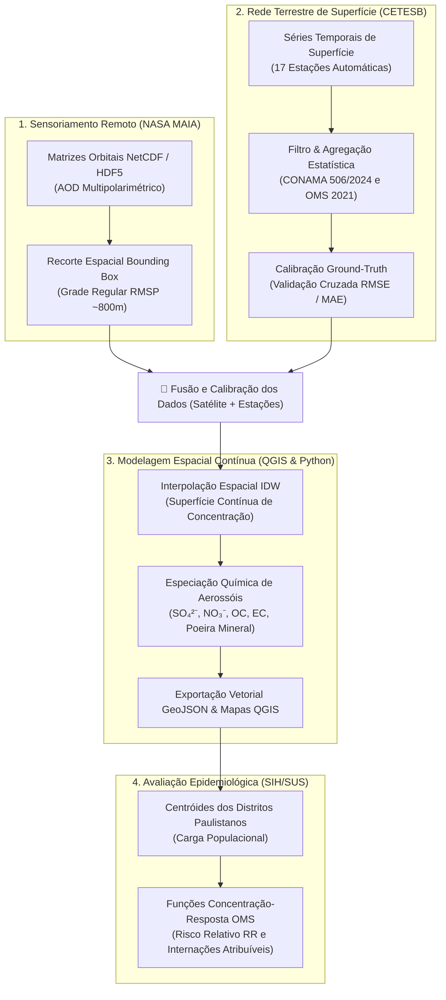
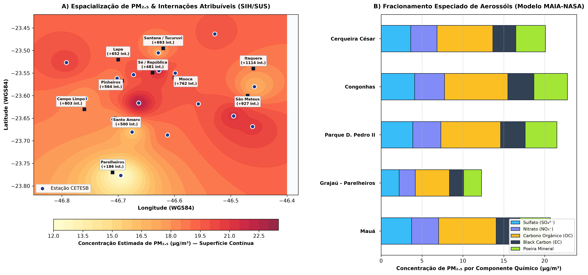

# Integração Geoespacial: Sensoriamento Remoto MAIA-NASA, Rede CETESB e Saúde Pública (SIH/SUS)

[](https://www.python.org/)
[](https://qgis.org/)
[](https://maia.jpl.nasa.gov/)
[](https://cetesb.sp.gov.br/)
[-lightgrey)](#)
[](#)

Pipeline automatizado em **Python** e ambiente **QGIS** desenvolvido para modelagem matricial, espacialização contínua de aerossóis atmosféricos (PM₂.₅ e PM₁₀), especiação química e estimativa de risco relativo em saúde coletiva (internações hospitalares do SUS) na Região Metropolitana de São Paulo.

> **Contexto de Aplicação:** Desenvolvido como projeto preparatório e demonstração de competências para a vaga de estágio em pesquisa aplicada do **Núcleo de Sistemas Eletrônicos Embarcados (NSEE - Instituto Mauá de Tecnologia)** em cooperação com a **Faculdade de Saúde Pública da Universidade de São Paulo (FSP-USP)**, no âmbito do programa *Early Adopters* da **Missão MAIA da NASA**.

---

## 🎯 Fundamentação Científica & Desafio Tecnológico

A **Missão MAIA (Multi-Angle Imager for Aerosols)** da NASA investiga a correlação entre diferentes tipos de partículas em suspensão e desfechos cardiorrespiratórios. A integração entre sensoriamento remoto orbital e impacto epidemiológico terrestre é estruturada em quatro etapas metodológicas:



---

## 📐 Formulação Matemática & Física do Modelo

### 1. Relação Coluna Atmosférica $\leftrightarrow$ Concentração de Superfície
Sensores orbitais medem a **Espessura Óptica de Aerossóis ($AOD$)**, uma grandeza adimensional que integra a extinção óptica em toda a coluna vertical:

$$AOD = \int_0^\infty \sigma_{ext}(z) \, dz$$

A estimativa da concentração de superfície de PM₂.₅ ($\mu g/m^3$) é parametrizada em função da altura da Camada Limite Planetária ($PBLH$) e do fator de crescimento higroscópico dos aerossóis $f(RH)$:

$$PM_{2.5} \approx \eta \cdot \frac{AOD}{PBLH \cdot f(RH)}, \quad \text{onde } f(RH) = \left(1 - \frac{RH}{100}\right)^{-\gamma}$$

### 2. Superfície Contínua por Inverso da Distância Ponderada (IDW)
Para estimar a exposição fora das estações de monitoramento, implementou-se a interpolação geoespacial:

$$\hat{Z}(s_0) = \frac{\sum_{i=1}^n w_i(s_0) Z(s_i)}{\sum_{i=1}^n w_i(s_0)}, \quad w_i(s_0) = \frac{1}{\|s_0 - s_i\|^p}, \quad (p=2)$$

### 3. Estimativa de Impacto Epidemiológico (Concentração-Resposta)
A quantificação do Risco Relativo ($RR$) para internações cardiovasculares (CID-10 I00-I99) e respiratórias (CID-10 J00-J99) segue a função log-linear da OMS com limiar de referência $C_0 = 5,0\,\mu g/m^3$:

$$RR = \exp\left(\beta \cdot \max(0, C - C_0)\right)$$

A Fração Atribuível Populacional ($PAF$) e as internações atribuíveis ($I_{atrib}$) são dadas por:

$$PAF = \frac{RR - 1}{RR}, \quad I_{atrib} = I_{base} \cdot PAF$$

---

## 🗺️ Visualizações Geoespaciais & Resultados

O pipeline gera composições cartográficas científicas de alta densidade (300 DPI):



**Figura 1:** **A)** Superfície contínua de concentração de PM₂.₅ na Grande São Paulo com estações CETESB e impacto de internações por distrito. **B)** Especiação química estimada dos aerossóis (alvo central da instrumentação MAIA).

---

## 📊 Relatório Epidemiológico por Distrito (Amostragem SIH/SUS)

Estimativa anual de internações cardiorrespiratórias atribuíveis à poluição excedente em distritos-chave da capital:

| Distrito Paulistano | PM₂.₅ Médio (µg/m³) | RR Cardiovascular | RR Respiratório | Internações Atribuíveis / Ano |
| :--- | :---: | :---: | :---: | :---: |
| **Itaquera** | 17.15 | 1.102 | 1.143 | **+1.062** |
| **São Mateus** | 19.34 | 1.121 | 1.171 | **+1.011** |
| **Campo Limpo** | 18.02 | 1.109 | 1.154 | **+795** |
| **Santana / Tucuruvi** | 17.84 | 1.108 | 1.152 | **+674** |
| **Mooca** | 19.78 | 1.125 | 1.176 | **+762** |
| **Pinheiros** | 18.72 | 1.116 | 1.163 | **+563** |
| **Sé / República** | 20.91 | 1.136 | 1.191 | **+484** |

---

## 📁 Estrutura Técnica do Repositório

```text
cetesb-air-quality-sp/
├── maia_spatial_engine.py             # Motor mestre: física AOD, IDW, especiação e risco SIH/SUS
├── pipeline_cetesb_sp.py              # Ingestão de estações CETESB, agregação e exportação GeoJSON/CSV
├── demo_netcdf_spatial_clip.py       # Demonstração de recorte de matrizes NetCDF (MAIA L2/L3)
├── qgis_style_loader.py               # Script para carregar e estilizar automaticamente no console QGIS
├── cetesb_estacoes_qualidade_ar.geojson # Camada vetorial georreferenciada (WGS84 EPSG:4326)
├── cetesb_estacoes_especiacao_maia.csv # Tabela com fracionamento químico (SO4, NO3, OC, EC, Dust)
├── exposicao_e_saude_distritos_sp.csv # Dados de exposição e métricas epidemiológicas por distrito
├── validacao_satelite_cetesb.csv       # Matriz de validação cruzada entre satélite e estações
├── mapa_analise_integrada_sp.png      # Composição cartográfica analítica de alta resolução (300 DPI)
└── mapa_qualidade_ar_sp.png           # Mapa temático clássico das estações de monitoramento
```

---

## 🛠️ Como Executar o Pipeline Localmente

```bash
# 1. Clonar repositório
git clone https://github.com/f1scher01/cetesb-air-quality-sp.git
cd cetesb-air-quality-sp

# 2. Executar o motor geoespacial completo
python maia_spatial_engine.py

# 3. Executar o módulo de calibração espacial de satélite
python demo_netcdf_spatial_clip.py
```

### No QGIS:
1. Abra o **QGIS 3.34 LTR**;
2. Arraste `cetesb_estacoes_qualidade_ar.geojson` para o Canvas;
3. Ou abra a console Python (`Ctrl+Alt+P`) e execute `qgis_style_loader.py` para carregamento imediato.

---

## 👤 Autor

**Lucas Fischer Paez**  
*Graduando em Engenharia Mecânica — Instituto Mauá de Tecnologia (2º Ano)*  
*Coeficiente de Rendimento: 8,23 / 10 | Lean Six Sigma Green Belt*  
*Pesquisa de Interesse: Telemetria, Sensoriamento Remoto, Dinâmica de Fluidos/Poluentes e Métodos Numéricos.*

* **LinkedIn:** [linkedin.com/in/lucasfischerpaez](https://www.linkedin.com/in/lucasfischerpaez)
* **GitHub:** [github.com/f1scher01](https://github.com/f1scher01)
* **E-mail:** fischer.paez@gmail.com
