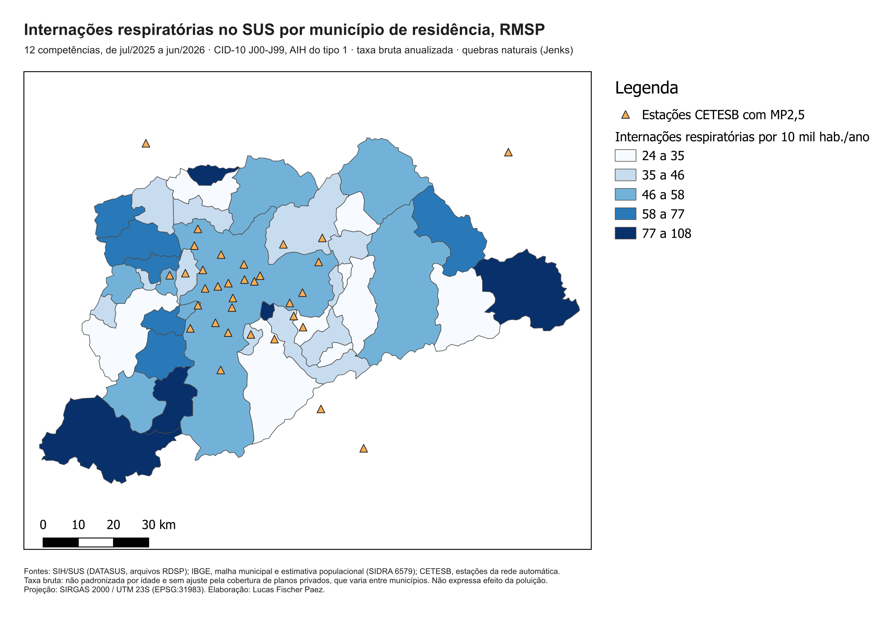
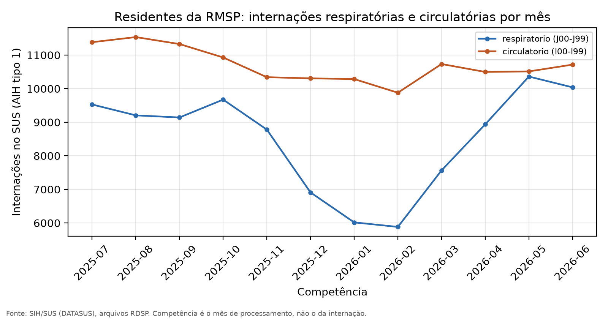

# Poluição do ar e saúde na RMSP: GOES-19 × CETESB × SIH/SUS × QGIS

### Pipeline com dados reais de satélite, rede de superfície, internações hospitalares e limites oficiais

[](#fontes)
[](#decisões-técnicas)
[](#como-executar)
[](#2-internações-respiratórias-e-circulatórias-no-sus)

Este repositório integra, para a Região Metropolitana de São Paulo:

- **profundidade óptica de aerossóis (AOD 550 nm)** do satélite GOES-19, lida em NetCDF-4 e reprojetada da grade geoestacionária;
- **MP2,5 da rede automática da CETESB**, coletado do serviço público que alimenta o QUALAR;
- **internações do SUS** por doenças respiratórias e circulatórias, lidas direto dos arquivos DBC do DATASUS;
- **limites municipais e população estimada** do IBGE;

e monta os mapas no **QGIS por script**, sem abrir a interface. O Python que acompanha o QGIS 3.44 LTR roda tudo; a única dependência extra é o descompressor dos arquivos do DATASUS.

> **Contexto.** A missão MAIA (NASA/ASI) vai produzir mapas diários de MP2,5 especiado a 1 km para
> estudos de saúde, com lançamento previsto hoje para 2027–2028. Enquanto não há dado MAIA, este
> repositório monta a cadeia completa com os produtos que já existem: mesmo tipo de grandeza (AOD),
> mesmo formato de arquivo (NetCDF/HDF5), a mesma rede de superfície e a mesma base de desfecho
> hospitalar.

---

## 1. Satélite × superfície


**Figura 1.** AOD do GOES-19 às 19:00 UTC de 11/09/2026 (pixels com DQF > 1 removidos, em branco)
e MP2,5 das estações da CETESB na mesma hora.


**Figura 2.** Colocalização das 13 estações com ao menos 3 pixels válidos na janela 3×3.

| Grandeza | Valor |
| :--- | :--- |
| Scan | GOES-19 ABI, disco completo, 11/09/2026 19:00 UTC |
| Cobertura válida no domínio (DQF ≤ 1) | 45,1 % dos pixels |
| AOD mediano no domínio | 0,10 (P90 = 0,17) |
| Estações com MP2,5 na hora do scan | 32 |
| Pares válidos (≥ 3 pixels na janela) | 13 |
| Correlação | Pearson r = 0,09 (p = 0,77) · Spearman ρ = −0,09 (p = 0,76) |

**Não há correlação neste scan, e isso é o esperado.** Quatro razões, em ordem de peso:

1. **Grandezas diferentes.** AOD integra a extinção da coluna inteira num instante; MP2,5 é massa
   junto ao solo. A ponte entre as duas passa pela altura da camada limite e pela umidade.
2. **Escalas de tempo diferentes.** O índice da CETESB para MP2,5 acompanha média de 24 h; o scan
   dura 10 minutos.
3. **Faixa estreita.** As 13 estações ficaram entre 6 e 19 µg/m³ num dia limpo; com n = 13, qualquer
   correlação real ficaria abaixo do ruído.
4. **Viés de superfície urbana e borda de nuvem.** Os maiores AOD (0,36–0,39) aparecem em Mooca,
   Parque D. Pedro II e Santana, com 4 a 6 pixels válidos em 9.

Um scan valida a cadeia de processamento, não a relação física.

---

## 2. Internações respiratórias e circulatórias no SUS



**Figura 3.** Taxa bruta anualizada de internações respiratórias (CID-10 J00–J99) por município de
residência, em 12 competências. Quebras naturais (Jenks), montado por `qgis_mapa_saude.py`.



**Figura 4.** Internações mensais de residentes da RMSP por competência do SIH/SUS.

| Indicador (jul/2025 a jun/2026, residentes da RMSP) | Valor |
| :--- | :--- |
| AIH aprovadas no estado nas 12 competências | 2,98 milhões |
| Internações respiratórias (J00–J99) | 102.034 |
| Internações circulatórias (I00–I99) | 128.442 |
| Pneumonias (J12–J18) entre as respiratórias | 40.369 (39,6 %) |
| DPOC e asma (J40–J47) | 15.083 (14,8 %) |
| Crianças de 0 a 4 anos / idosos de 65+ | 31,9 % / 26,1 % |
| Letalidade hospitalar respiratória | 9,4 % |
| Permanência média e valor pago (respiratórias) | 6,3 dias · R$ 160,7 milhões |
| Taxa respiratória na RMSP | 47,3 por 10 mil hab./ano (capital: 48,3) |
| Menor e maior taxa municipal | Rio Grande da Serra 23,6 · Juquitiba 107,8 |

**O que os números mostram e o que não mostram.**

- **Sazonalidade forte.** As internações respiratórias caem de 9.673 (out/2025) para 5.882
  (fev/2026) e sobem até 10.360 (mai/2026), um fator de 1,8. Outono e inverno concentram a
  circulação de vírus respiratórios e também o período de pior dispersão atmosférica em São Paulo.
  Com dado mensal agregado, os dois efeitos são indistinguíveis. Separá-los exige série diária,
  defasagem e ajuste por temperatura, que é justamente o desenho de um estudo de séries temporais.
- **A geografia não segue a poluição.** As taxas variam 4,6 vezes entre municípios, com os maiores
  valores na periferia (Juquitiba, Francisco Morato, Salesópolis, Embu-Guaçu). Taxa bruta de
  internação no SUS reflete a dependência do sistema público, a estrutura etária e a oferta de
  leitos, que este indicador não padroniza.
- **O satélite ainda não entra no modelo.** A camada integrada traz o AOD médio de cada município
  (26 dos 39 com pixel válido no scan de 11/09), mas um scan não representa a exposição de um ano.
  A junção existe para que o modelo possa ser construído sobre ela, não para sugerir associação.

---

## Pipeline

| Etapa | Script | Fonte | Saída |
| :--- | :--- | :--- | :--- |
| 1. Coleta de superfície | `coleta_cetesb.py` | CETESB, serviço ArcGIS público do QUALAR | série horária acumulada (CSV), estações (GeoJSON) |
| 2. Limites e população | `limites_ibge.py` | IBGE, APIs de malhas, localidades e SIDRA 6579 | 39 municípios com população estimada (GeoJSON) |
| 3. Satélite | `goes_aod.py` | NOAA GOES-19 ABI L2 AOD, bucket público | AOD recortado e filtrado (GeoTIFF) |
| 4. Colocalização | `colocalizacao.py` | saídas 1 e 3 | pares AOD × MP2,5 (CSV), dispersão (PNG) |
| 5. Internações | `sih_sus.py` | DATASUS, FTP público do SIH/SUS | internações agregadas por município e mês (CSV) |
| 6. Integração | `analise_saude.py` | saídas 2, 3 e 5 | camada municipal integrada (GeoPackage), série mensal (PNG) |
| 7. Cartografia | `qgis_mapa.py`, `qgis_mapa_saude.py` | saídas anteriores | layouts exportados (PNG) e projetos `.qgz` editáveis |

Parâmetros e justificativas ficam centralizados em `config.py`.

---

## Decisões técnicas

### Satélite

**Leitura pelo driver netCDF do GDAL.** O GDAL embarcado no QGIS lê a projeção geoestacionária do
ABI com o eixo de varredura correto (`+proj=geos +sweep=x +h=35786023`), aplica `scale_factor` e
`add_offset` da variável e entrega a matriz georreferenciada, sem dependências fora do QGIS.

**Vizinho mais próximo na reprojeção.** O `DQF` é categórico e não pode ser interpolado; o AOD usa
o mesmo método para continuar alinhado pixel a pixel com a sua flag. Grade de saída de 0,02°
(~2,1 km), próxima da resolução nativa do ABI sobre São Paulo.

**Filtro DQF ≤ 1** (alta e média qualidade) e **janela 3×3 com mínimo de 3 pixels válidos** na
colocalização, para reduzir ruído e contaminação por borda de nuvem.

### CETESB: o serviço publica índice, não concentração

As camadas do mapa do QUALAR trazem o **índice de qualidade do ar**, adimensional.
`coleta_cetesb.py` inverte a função linear segmentada para µg/m³, com pontos de quebra
**verificados nos próprios dados**: na faixa N1 só aparecem os índices {3, 5, 8, 11, 13, 16, 19,
21, 24, 27, 29, 32, 35, 37, 40}, exatamente `round(40·C/15)` para C inteiro de 1 a 15 µg/m³. Isso
põe o limite de N1 em 15 µg/m³, o padrão final da Resolução CONAMA 506/2024.

A Tabela 2.7 do *Relatório de Metodologia para Avaliação da Qualidade do Ar* (CETESB, 2025) lista
N1 até 25 µg/m³; com esse limite apareceriam índices como 2, 6 e 10, que nunca ocorrem. O pipeline
segue os dados e registra a divergência em `config.py`. Incerteza da inversão: ±0,19 µg/m³ em N1.

### SIH/SUS

**Leitura do DBF sem biblioteca.** Depois de descomprimido, o arquivo é um dBase III de registros
com largura fixa. `sih_sus.py` lê os descritores de campo do cabeçalho, monta um `dtype`
estruturado do NumPy e mapeia o arquivo em memória, extraindo só as 9 colunas usadas das 114
disponíveis. Um mês com 250 mil AIH e 167 MB é lido em poucos segundos.

**Só AIH do tipo 1.** O campo `IDENT` distingue a AIH principal (1) das de prorrogação de longa
permanência (5). Contar as duas duplicaria internações longas.

**Residência, não hospital.** O filtro usa `MUNIC_RES`, o código IBGE de 6 dígitos (sem dígito
verificador) do município onde o paciente mora, que é a unidade de exposição.

**Competência não é data da internação.** Cada arquivo reúne AIH aprovadas naquele mês; internações
longas ou cobranças atrasadas aparecem em competências posteriores. A série da Figura 4 é por
competência; o CSV agregado guarda também o mês de internação (`DT_INTER`) para análises que
precisem dele.

**Privacidade.** Os arquivos brutos trazem CEP e data de nascimento. Eles ficam em
`dados/brutos/sih/`, fora do git, o DBF descomprimido é apagado após a leitura e só a tabela
agregada por município, mês, capítulo e faixa etária é versionada.

### Cartografia

Projetos em **SIRGAS 2000 / UTM 23S (EPSG:31983)** para barra de escala métrica. Coroplético em
**quebras naturais (Jenks)** porque a distribuição das taxas é assimétrica, com cauda nos municípios
pequenos.

---

## Como executar

Pré-requisito: **QGIS 3.44 LTR**. O Python dele já traz GDAL, NumPy, Pandas, SciPy, Matplotlib e
Requests. Uma vez só, para ler os arquivos do DATASUS:

```bat
python -m pip install --user datasus-dbc
```

Pipeline completo (hora UTC do scan e competências inicial e final do SIH):

```bat
executar_pipeline.bat 2026-09-11T19 2507 2606
```

Ou etapa por etapa, pelo `python-qgis-ltr.bat` da instalação:

```bat
python coleta_cetesb.py              :: últimas 48 h da CETESB, acumulando na série
python limites_ibge.py               :: municípios e população da RMSP
python goes_aod.py 2026-09-11T19     :: baixa o primeiro scan da hora (UTC) e recorta
python colocalizacao.py              :: pares e estatística
python sih_sus.py 2507 2606          :: 12 competências do SIH/SUS (~240 MB, ~7 min)
python analise_saude.py              :: camada municipal integrada e série mensal
python qgis_mapa.py                  :: mapa AOD × MP2,5
python qgis_mapa_saude.py            :: mapa das internações
```

A janela da CETESB é móvel (48 h): para montar histórico, agende `coleta_cetesb.py` uma vez por
dia no Agendador de Tarefas do Windows. Os projetos `qgis/*.qgz` abrem no QGIS com camadas e
layouts prontos para ajuste manual.

---

## Fontes

- **NOAA GOES-19 ABI L2+ Aerosol Optical Depth** (`ABI-L2-AODF`), NOAA Open Data Dissemination, bucket `noaa-goes19`.
- **CETESB**, serviço ArcGIS REST `QUALAR/CETESB_QUALAR`; *Relatório de Metodologia para Avaliação da Qualidade do Ar* (2025), Tabela 2.7.
- **DATASUS**, Sistema de Informações Hospitalares do SUS, arquivos `RDSP<AAMM>.dbc`.
- **IBGE**, API de malhas territoriais v3, API de localidades (região metropolitana 04901) e SIDRA, tabela 6579.

---

## Limitações

- Um único scan colocalizado; nenhuma conclusão física sai de n = 13.
- MP2,5 vem da inversão do índice publicado, não da medição original em µg/m³.
- Taxas de internação brutas: sem padronização por idade e sem ajuste pela cobertura de planos privados.
- Internações de residentes da RMSP em hospitais fora do estado de São Paulo não entram nos arquivos RDSP.
- O AOD geoestacionário tem ~2–3 km sobre São Paulo e sofre com superfície urbana clara.

## Próximos passos

1. **Série diária de exposição.** Acumular a coleta da CETESB e obter o histórico em µg/m³ pela
   exportação do QUALAR (requer cadastro), que também confirma os pontos de quebra do índice.
2. **Modelo de séries temporais.** Internações diárias por `DT_INTER` contra MP2,5 com defasagens de
   0 a 7 dias, ajustado por temperatura, umidade, dia da semana e sazonalidade.
3. **Padronização por idade** das taxas municipais com a pirâmide etária do Censo 2022.
4. **AOD normalizado pela camada limite** (PBLH do ERA5 ou do MERRA-2) e comparação com o MAIAC
   MCD19A2 de 1 km, para medir o ganho de resolução no centro urbano.

---

## Legado: versão sintética

A primeira versão deste repositório demonstrava o método com **valores escritos à mão**. Ela foi
mantida em [`legado_sintetico/`](legado_sintetico/) como registro, com cada arquivo rotulado como
sintético. Nada daquela pasta alimenta o pipeline acima. O que continua válido é a formulação
(IDW implementado à mão e função concentração-resposta log-linear), a ser reaplicada sobre dado real.

---

## Autor

**Lucas Fischer Paez** · Engenharia Mecânica, Instituto Mauá de Tecnologia (2º ano)

[LinkedIn](https://www.linkedin.com/in/lucasfischerpaez) · [GitHub](https://github.com/f1scher01) · fischer.paez@gmail.com
